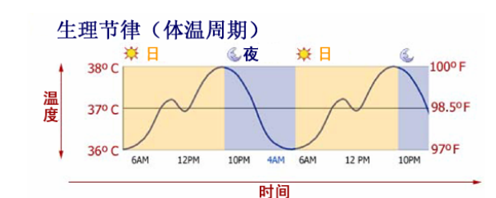

# Powerful Sleep神奇的睡眠

## 一、有关睡眠的常见误区
### 1.你每天得睡8个小时，才能在整个白天进行正常活动。

## 二、睡眠机制
### 1.那什么是高质量的睡眠？
实际上，我们的身体中有一个潜在的机制，叫做身体生物钟（body clock）。但我并不是很喜欢这个名字，因此我将其称为 **睡眠生物钟（sleep clock）**。你的睡眠生物钟是一个内在的系统，它能控制你如何入睡，睡得多熟，何时入睡，以及你在白天醒来后感觉如何。一旦你把这个系统弄明白了，你就能控制你的睡眠和精力储备了！

### 2.生理节律
你体内的睡眠生物钟里最首要、也是最重要的部分就是你的 **体温节律（body temperature rhythm）**，也叫生理节律（circadian rhythm）。

影响你睡眠生物钟的次重要因素就是你的**褪黑素水平**，以及**接受自然日光**的情况。

### 3.褪黑素和阳光
褪黑素（Melatonin）是一种激素。这种激素大部分由松果腺分泌，而少部分则在视网膜中产生。褪黑素负责让你入睡，然后在你睡着后恢复精力。如果你体内的褪黑素含量较高时，你会感到瞌睡，体能不佳等状况。

由于褪黑素具有在我们 **处于黑暗**中时开始分泌的这种特性，它有时也被称为吸血鬼激素（vampire hormone）。

### 4.运动量
你每晚的活动量和有氧运动量对你的体温节律也有着巨大的影响。

任何运动锻炼都能快速提高体温，这对你的睡眠系统很有好处。锻炼能延缓天黑后体温的下降，让你更长时间地保持清醒警觉。最后我要说的是，**锻炼能让你在一天结束时体温更迅速地下降，然后更长时间地保持更低的温度。这能保证你能睡得更熟**。

### 5.非睡眠时间
如果你睡了8、9个小时，但白天仍觉得很困。这可能是你需要**减少睡眠**时间的一个信号。你实在睡得太多了，你需要**增加**你的非睡眠时间，以平衡你的体温节律，让你入能睡得更熟。

## 三、优化你的睡眠生物钟
- 第一步：取得正确的信息
- 第二步：制定周密的计划
- 第三步：行动！

### 1.摄取足够的阳光
在室内呆一天，对于我们的眼睛来说和在完全黑暗中呆一天没有什么区别！

### 2.太阳镜的影响
试着尽量**少戴**太阳镜，用常识来判断你某个时候戴太阳镜是否合适。如果你整天戴着，你的眼睛只能摄入最少量的阳光，这一定会影响你的体温节律。

### 3.人造光源
光疗法能调节我们的情感和白天时的心情；目前已知它可以用于治疗压抑症等心理疾病。冬季抑郁症的主要诱因就是冬季缺少足够的光线。这也是冬天人们爱睡觉的原因。

### 4.锻炼是如何影响你的体温节律的
如果你不让你的身体动起来，你又如何能让自己年轻起来，并提高自己的睡眠质量呢？

### 5.神奇的打盹 – 睡得少体能好的灵丹妙药
#### 1)适当而有规律的在白天打个小盹，可能对你日常的精神状况有很大提高。
打盹的正确方式就是把时间控制得很短。这能在补充你体能的同时避免进入熟睡状态。一些研究甚至表明，短时间打盹能把得冠心病的几率下降30%

把午睡时间限制到45分钟内。如果你**打盹后仍觉得很累**，那就**缩短打盹时间**。各人进入熟睡状态所需要的时间并不相同。

#### 2)周末 – 你睡眠系统最可怕的梦魇
周末睡懒觉对睡眠系统是有害的。

### 6.按时起床和入睡

### 7.水和睡眠——我们在睡眠中面临渴死的危险！ 
如果你一天内没有喝上**至少8杯水**，你体内的水分很有可能会不足！

当我决定**戒掉**我每天喝的所有**饮料**（汽水，咖啡，果汁），除了白开水之外什么东西都不喝时，效果是立竿见影的。

### 8.食物是如何影响你的睡眠的——少吃
你的消化系统需要的能量越多，你的睡眠质量就越低。

其他会降低睡眠质量的食物有：
> 含有高糖份和简单的碳水化合物的食物会升高你体内的血糖含量，造成能量爆发（显然会影响你的睡眠系统）

### 9.睡姿
仰卧的睡法很好。但趴着睡，甚至需要趴着才能入睡就会对你的睡眠以及背部产生很大的影响。

## 四、今夜无法入眠？ 
### 1.入睡性失眠（Sleep Onset Insomnia）

### 2.睡眠维持性失眠（Sleep Maintenance Insomnia）

### 3.睡眠障碍性失眠（Sleep Disturbance Insomnia）
症状是虽然可以正常入睡，睡眠时间也正常（成人7到8小时，老年人5到6小时）但睡醒后感觉不舒服，头痛，困倦等。

### 4.别去想任何事情。
这很简单：你必须将注意力集中到放松身心上，并且试着*迫使*你进入睡眠。

### 5.让——你——的——思——维——慢——下——来——的——方——法……
你所要做的就是，用脑子**重复**你思维里所想的每一句话的每一个音节，或者如果你有很强的立体观感，你可以把你思维里每一句话的每一个字，在脑子里画出来，就像你的面前有一张纸和一只在写字的笔一样。然后，有意识地用**慢动作**重复你刚才所想的音节或画面。

### 6.黑板放松法
当你有新的想法时
> 噢，不，明天我该穿些什么呢？ 

想象这句话被写在黑板上，然后再被逐渐擦除的情景，最后只留下一个空空的黑板。

### 7.与辗转反侧斗争到底
翻身的原因，并不是因为你真的觉得躺得不舒服，而是你不够放松的结果。

尽量不要翻身。

你实在是太想翻身了，可以这样做：
- 慢慢地翻身。记得你早上醒来，睡眼惺忪时的感觉吗？你可能在那时快速翻身么吗？
-  由于你翻身翻得很慢，你可以微笑一下，然后做个深呼吸。

翻身让我们无法入睡的另一个重要原因就是我们每次翻身都翻得太快了。而我们**翻得越快**，就越容易**激动**。因此我们需要动作得慢一些，而且保持微笑和深呼吸，就能感觉到有什么不同了。

### 8.限制睡眠
如果你躺在床上30分钟都无法入睡，就起床吧！直到你重新感觉到倦意袭来了，再重新回到床上。

### 9.床只用来睡觉
别把你的卧室当成办公室，或健身房，或储藏室。白天离床远一些，别躺在床上打电话，你的窗只应用来睡觉或做爱做的事。

### 10.洗个热水澡吧
睡前60到90分钟洗个热水澡能帮助你入睡。但如果你在洗了热水澡后立刻睡觉，那体温的升高可能会让你觉得入睡更困难了。

### 11.室内温度——清凉
研究表明，在凉爽而气氛悠闲的室内，比在一个很热的环境下更容易入睡。你凉爽的环境下能睡得更熟一些

### 12.光线是如何造成失眠的
让你的睡眠环境越黑暗越好。

### 13.安眠药——睡眠系统的死敌

## 五、行之有效的个人睡眠计划 
### 1.为了减少你在睡眠上所花费的时间，你必须首先提高你的睡眠质量。
影响你睡眠**最重要**的两个因素是：
- 1) 光线摄取量
- 2) 白天的活动程度

### 2.了解曝光量的知识
- 在室内，我们平均能接触1到500lx的光线。
- 在日出时，我们平均能接触5,000到10,000lx的光线。
- 正午和下午 ，我们平均能接触50,000到100,000lx的光线。
- 日落时，我们平均能接触5,000到10,000lx的光线。

如果你每天能接触到高强度光线的时间少于1小时，那你就会接触不到足够的阳光。记住，对于你的眼睛来说，在室内所能接触的光线和在一个完全黑暗的环境中几乎没有区别。白天所处的环境越昏暗，作为结果晚上你的睡眠就越差

### 3.说提升自己白天的精神状况和减少睡眠时间是相辅相成的.

### 4.行之有效的个人睡眠计划
#### 1)阳光照射
- 在起床后应立即让眼睛接触到阳光
- 长时间呆在室内时也要接触高强度光线
- 减少使用太阳镜的次数

#### 2)锻炼情况
- 每天进行至少15分钟的有氧运动
- 尽量在早晨进行锻炼
- 睡前两小时内别锻炼
#### 3)有用的打盹
- 打盹醒来后多活动一下，接触一些阳光就清醒了
- 一般一天只打一次盹。如果你觉得你需要再打一个盹了，那越短越好。
- 防止打盹睡过头的最好方法——**闹铃**
#### 4)适量饮水

## 六、你该如何使用本教程？
- 接触阳光
- 多多走动！！！
> 每一个睡眠问题的个案，都和不爱活动有很大关

## 七、身心放松法 
### 方法一
> 闭上眼睛。 开始深呼吸。 吸气……吸气的动作保持3秒…… 呼气……呼气的动作保持3秒…… 重复这个过程，一直深呼吸。 当你注意到你的腹部肌肉随呼吸胀缩时： 注意一下脑部的重量。 注意眉部所受到的压力。 注意嘴唇的湿润程度。 注意脸颊肌肉的紧张程度。 放松你的脸部肌肉…… 注意你整个身体的重量…… 注意腹部肌肉胀缩的感觉…… 注意你手臂的重量…… 注意你双手的重量…… 开始留意你指尖的的重量…… 注意你手臂和肩膀的紧张程度…… 放松你的手臂…… 注意你腿部的重量…… 注意你大腿肌肉的紧张程度…… 放松你的腿部…… 注意你小腿和脚部的重量…… 感觉你大脚趾的存在…… 现在…… 注意你全身的重量…… 长叹一口气后放松…… 放松你全身的肌肉……

### 方法二
> 从深呼吸开始，将注意集中在你的深呼吸上。注意你的腹部肌肉正随呼吸胀缩。注意这种胀缩给你带来的感觉。 想想是什么情况让你感觉有压力。 重复想想最近你对自己说了什么，并将注意力集中在这些话

> 想想目前问题解决，你得到你想要的结果后你的感觉。 想象自己所希望的最终结果的景象，以一幅图片的形式出现。让这幅图片以幻灯片的方式在脑海中浮现。以第三人称看整个结果。 当你看到这幅图片时，保持笑脸并对自己说：嗯……啊……好爽…… 做一个很深的深呼吸，同时让这幅图片在脑中越变越大，越变越大。 将这幅图片放在一边，然后按照你所希望事情发展的结果再想象出一幅图片。这是后来你享受这个结果时的图片。看看图片中你笑得多么灿烂。 再次深呼吸，也让这幅图片在脑海中变大、变大。  注意到图片中每一个人都在笑，都显得愉快而放松。

